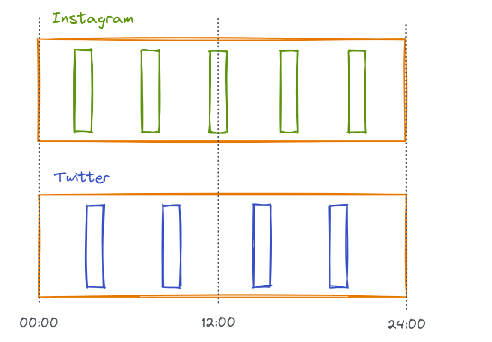
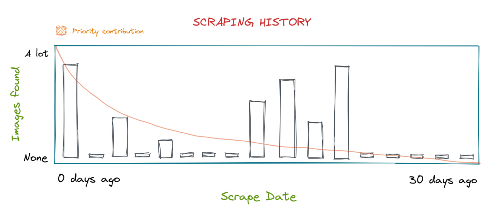

<h1>
  
</h1>

<p align="center">
  <b>Scrape multiple media providers on a cron job and dispatch webhooks when changes are detected.</b>
</p>

## Jiu

Jiu is a multi-threaded media scraper capable of juggling thousands of endpoints from different providers with unique
restrictions/requirements.

It is built for the purpose of fetching media posted on different sites the form of a slow, eventual-consistency, and
not for instant change detection.

## Providers

Provider is the umbrella term that encapsulates all endpoints for a given domain.

For example, https://weverse.io/bts/artist and https://weverse.io/dreamcatcher/artist are 2 endpoints under the Weverse
provider.

### Supported providers

* [Twitter](https://twitter.com/RBW_MAMAMOO)
* [Pinterest Boards](https://www.pinterest.com/janairaoliveira314/handong)
* [Weverse.io](https://weverse.io/dreamcatcher/feed)
* [United Cube](https://www.united-cube.com/)

## Dynamic Priority & Tokens

Dynamic priority is main idea behind how JiU can scrape many resources without getting rate limited.

Unique endpoints that have more than 1 token are grouped by their provider type and get scheduled to be scraped at even
intervals at the start of every day to avoid hammering APIs with requests.



After each successful request, a 30 day sliding window of that endpoint's request history gets graded on a curve that
determines how its priority should be changing based on how many new images it found in each request.



Pages that post at least one image regularly get assigned a higher priority, up to a maximum of 3 requests every 2 days.
Pages that don't post anything sink down to a scrape schedule of once every 2 weeks.

New results found in earlier dates have a higher contribution to priority than those found further back. This curve
allows JiU to match its request frequency with the changing posting schedule of sites it's processing to avoid wasting
requests on resources that are rarely updated.

At the end of each day, every endpoint gets tokens added to it equal to its current priority that get checked as a
criteria when scheduling requests the next day.

## Authorization

Anonymous request are always preferred when possible.

There is a customizable login flow for providers that require authorization which allows logging into APIs after an
authorization error, and persists additional data (such as a JWT token) to be shared across each provider during the
lifetime of the process.

The login flow is reverse engineered for providers that don't have a public API.

> Juggling multiple accounts per provider is currently not supported and probably won't be as long as your accounts aren't getting banned (and if they are then you're sending too many requests and need to increase your rate limits).

Jiu will try its best to identify itself in its requests' `User-Agent` header, but will submit a fake UA for providers
that gate posts behind a user agent check like Twitter.

## Proxies

Proxies are not supported or needed.

## Webhooks

Jiu is capable of sending webhooks to multiple destinations when an update for a provider is detected.

Although data about posts are aggregated within webhooks, they're not persisted to the database as that's the responsibility of the service receiving the events and are not relevant for image aggregation.

```json
{
  "provider": {
    "type": "twitter.timeline",
    "id": "729935154290925570",
    "ephemeral": false
  },
  "posts": [
    {
      "unique_identifier": "1460196926796623873",
      "body": "[#가현] 삐뚤빼뚤 즐거운 라이브였다❣️ 다음 주에도 재밌는 시간 보내 보카?\n\n#드림캐쳐 #Dreamcatcher #4주_집콕_프로젝트 https://t.co/r1ImPUPKkv",
      "url": "https://twitter.com/hf_dreamcatcher/status/1460196926796623873",
      "post_date": null,
      "account": {
        "name":"드림캐쳐 Dreamcatcher",
        "avatar_url":"https://pbs.twimg.com/profile_images/1415983453200261124/4-viIm27_normal.jpg"
      },
      "metadata": {
        "language": "ko",
        "like_count": 12474,
        "retweet_count": 2760
      },
      "images": [
        {
          "type": "Image",
          "media_url": "https://pbs.twimg.com/media/FEOpVKmagAELmzI.jpg",
          "reference_url": "https://twitter.com/hf_dreamcatcher/status/1460196926796623873/photo/1",
          "unique_identifier": "1460196885285994497",
          "metadata": {
            "width": 1128,
            "height": 1504
          }
        },
        {
          "type": "Image",
          "media_url": "https://pbs.twimg.com/media/FEOpV2FaAAEG4zr.jpg",
          "reference_url": "https://twitter.com/hf_dreamcatcher/status/1460196926796623873/photo/2",
          "unique_identifier": "1460196896958709761",
          "metadata": {
            "width": 1128,
            "height": 1504
          }
        }
      ]
    }
  ]
}
```

Every provider has its own `provider_metadata` field that _may_ contain extra information about the image or the post it
was found under, but may also be missing. _Documentation WIP_

The `unique_identifier` field is unique **per provider** and not globally.

The `ephemeral` field defines whether an image is only accessible for a short period after dispatch (for example
instagram image links expire after some time).

If a Discord webhook URL is detected, the payload is changed to allow Discord to display the images in the channel.

There is currently no retry mechanism for webhooks that fail to deliver successfully.

## Jiu is **NOT**:

* For bombarding sites like Twitter with requests to detect changes within seconds.
* Capable of executing javascript with a headless browser.
* Able to send requests to any social media site without explicit support.

## Jiu **IS**:

* For slowly monitoring changes in different feeds over the course of multiple hours without abusing the provider.
* Capable of adjusting the frequency of scrapes based on how frequently the source is updated.
* Able to send webhooks or push to AMQP on discovery.
* The lead singer of [Dreamcatcher](https://www.youtube.com/watch?v=1QD0FeZyDtQ).

## Usage

1. Copy over `.env.example` to `.env` and fill out relevant fields.
2. `docker-compose up -d jiu_db` to start postgres.
3. `RUST_LOG=jiu cargo run` to start the crawler

To create a production-ready image, make sure to run `cargo sqlx generate` before building if you modified any of the
SQL queries.

> If you would like to use this project, please change the `USER_AGENT` environment variable to identify your crawler accurately.

Built for [simp.pics](https://github.com/xetera/simp.pics)
